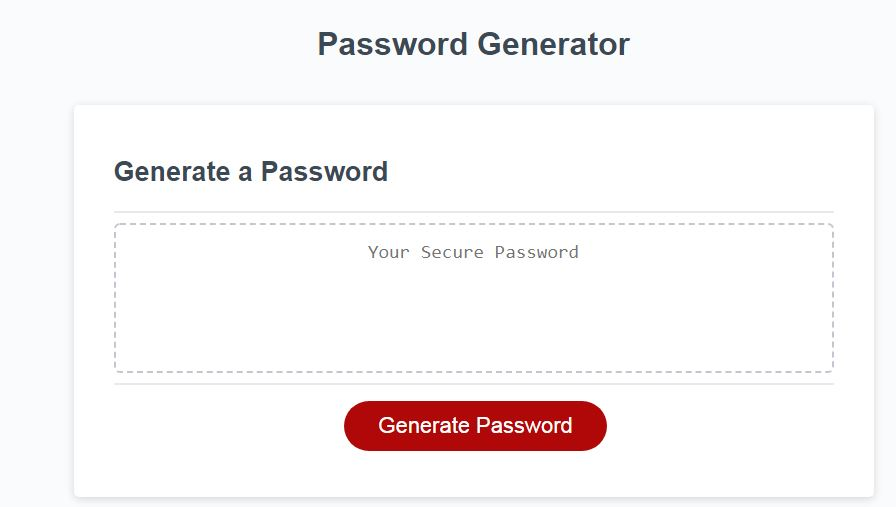
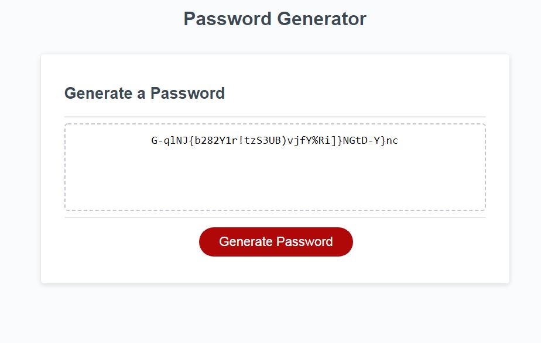

# SLV_PW_Generator
# Boot Camp Spot Assignment 3 - Password Generator

I have created a JavaScript app to generate a secure password with a user chosen set of criteria.
The JavaScript obtains the user input with some error checking, then using string manipulation and random number generation creates a password.

Click [here](https://scottyv6.github.io/SLV_PW_Generator/) to see the website hosted on GitHub

Images below

